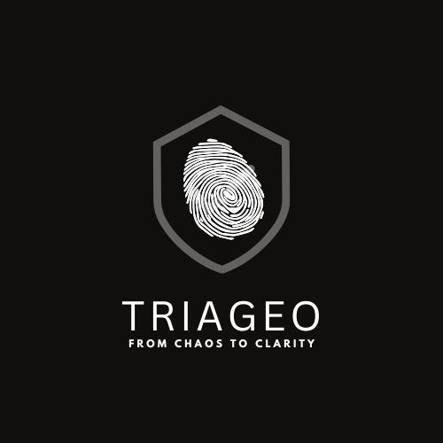

  

# 🚨 Triageo – AI-Powered Security Triage for Slack  

**THE PROMISE:** *From chaos to clarity, in seconds.*  

---

## 🌐 What is Triageo?  
Triageo is a **Slack-native AI security triage assistant** that helps teams cut through the noise of security alerts. Instead of manually sifting through endless logs: Triageo parses, classifies, and prioritizes incidents **directly** inside Slack. This gives security teams actionable insights instantly!  

---

## 🔑 Key Features  
- **Log Intelligence** → Automatically detects anomalies (failed logins, injection attempts, prompt injection signals).  
- **AI-Driven Triage** → Assigns severity levels (`low`, `medium`, `high`, `critical`), categorizes threats, and suggests recommended actions.  
- **Human-in-the-Loop Safety** → Interactive buttons for escalation, acknowledgement, and severity adjustments keep analysts in control.  
- **Grounded Decisions** → Backed by a lightweight Retrieval-Augmented Generation (RAG) over OWASP guidelines and security runbooks.  
- **Slack-Native UX** → No new dashboards — all results delivered where teams already work.  

---

## 🎯 Why Triageo?  
Security teams drown in alerts. Traditional SIEMs are complex and slow. Triageo is:  
- ⚡ **Fast** → From log to triage in under 5 seconds.  
- 🔑 **Accessible** → Drop-in setup for any Slack workspace.  
- 📈 **Scalable** → Handles everything from small team logs to high-volume incident streams.  

---

## 🏆 Hack the North 2025 Impact  
Triageo demonstrates how AI can simplify cybersecurity workflows by:  
- Bridging the gap between raw logs and actionable security response.  
- Empowering teams to respond faster with higher confidence.  
- Making advanced triage accessible to everyone — even small teams without dedicated SOCs.  

---

## 📂 Demo Flow  
1. Upload a sample log (e.g., `auth_burst.log`) to Slack and @mention Triageo.  
2. Triageo parses the log, detects anomalies, and assigns severity.  
3. Slack card displays category, summary, recommended actions, and evidence.  
4. Analyst chooses: 🚨 *Escalate*, 👀 *Acknowledge*, or ⬇️ *Lower severity*.  

---

## 🚀 Next Steps  (TODO THIS SECTION)
- Expand `/triageo threatmodel` to analyze system architecture (`system.md`) and highlight top threats.  
- Add persistent state to track escalations and acknowledgements.  
- Extend support for more log formats (network traffic, cloud events, etc.).  
